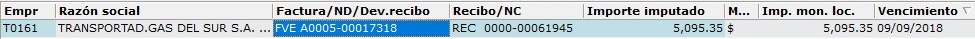
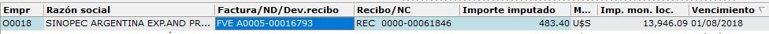

# Imputaciones

#### IMPUTACIONES DE VENTAS

**Como leerla**

Teniendo una imputación creada se lee de la siguiente forma

En una imputación se observa la empresa con su ID y razón social, la factura o nota de debito a cancelar, la nota de crédito o recibo a utilizar, el importe imputado, la moneda de la factura y el recibo, el importe en moneda local \(Pesos Argentinos\), este recibo en pesos es igual al valor imputado, solo variara en facturas en dólares, por último el vencimiento de la factura que se imputó.

**Creación**

Para aplicar notas de crédito o saldos a favor en recibos a facturas

> Tener en cuenta que la moneda de la factura y la nota de crédito/recibo debe ser la misma

Ir a: Ventas -&gt; Comprobantes -&gt; Imputaciones de ventas

 Se agrega un nuevo registro para completar, buscar la empresa por nombre \(se puede usar %\) o ID 

* Búsqueda por razón social

  

* Búsqueda por ID

  

Se completa el campo "_Factura/ND/Dev.recibo_", se ingresa el numero completo, por ejemplo "FVEA000500016046" con el formato _{tipo}{letra}{prefijo}{numero}_ o con la lupa que aparece a la derecha se puede buscar la factura  Se repite el paso para buscar el "_Recibo/NC_"

Finalmente quedaría listo para guardar con el botón "**Aceptar**" \(_Ctrl+Intro_\)  o cancelar la imputación con el botón "**Cancelar**" \(_Esc_\) 

Quedando así

**Duplicar**

Duplicar una imputación puede resultar útil para evitar la carga desde cero de todos los valores, se puede usar para tomar la misma empresa, la misma factura o nota de crédito.

Una vez teniendo el registro a duplicar le damos al botón duplicar  y quedaría algo así

Ahora desde las lupas podemos ir modificando los campos que necesitemos cambiar.

**Modificación**

El botón de modificar  permite modificar un registro, aunque simplemente modificando los valores necesarios ya nos daría la opción de guardar los cambio realizados sin requerir previamente el uso del botón.

**Eliminar**

Podemos eliminar una imputación por encontrarse mal imputada o el motivo que fuere, estando posicionados sobre el registro que deseamos eliminar, le damos al botón "**Borrar**" \(_Ctrl+Supr_\)  y esta esta se eliminara, liberando la factura y nota de crédito utilizada.

